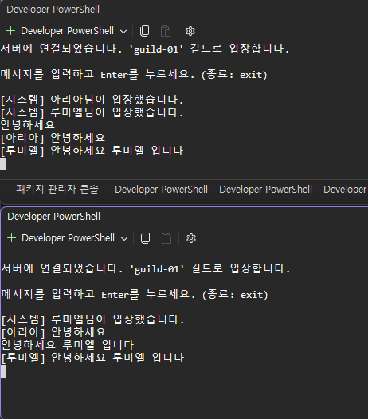
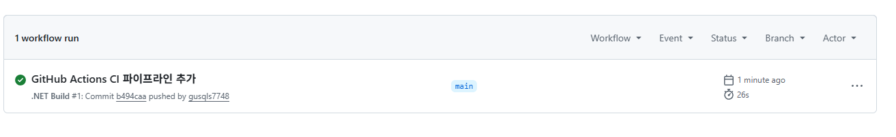
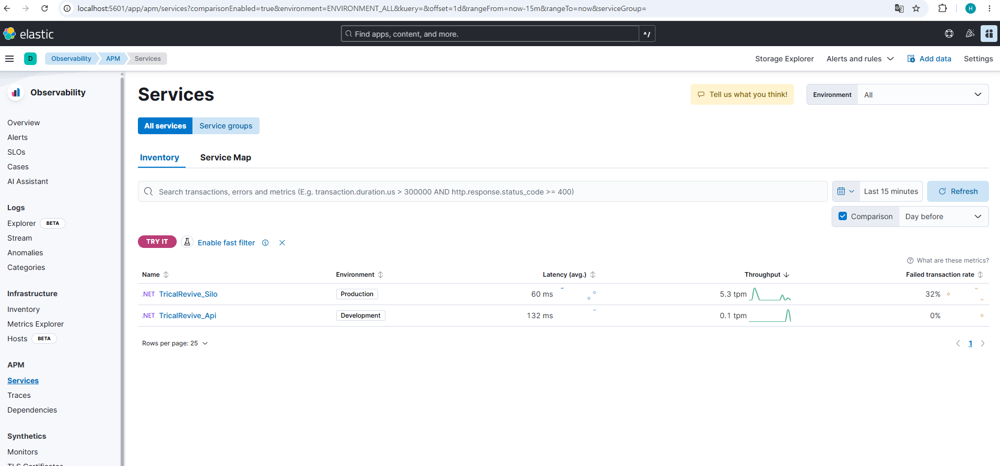
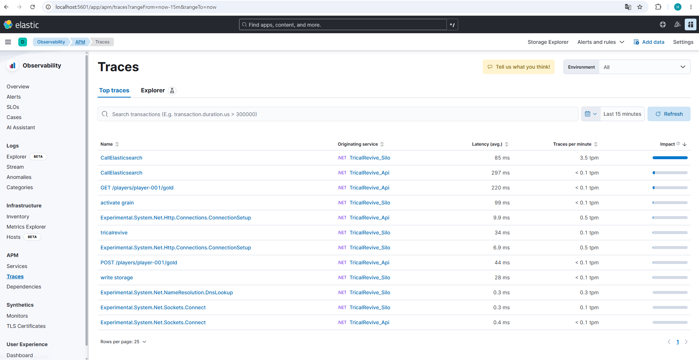

# TricalRevive Server

[](https://github.com/YOUR_GITHUB_USERNAME/TricalRevive/actions/workflows/dotnet-build.yml)

> 트릭컬 리바이브(Tricaltale) 채용 공고의 기술 스택을 기반으로, 수집형 서브컬처 RPG의 서버 아키텍처를 학습 및 실습하기 위해 만든 개인 포트폴리오 프로젝트입니다.
> Microsoft Orleans의 Virtual Actor 모델을 활용해 플레이어 단위 상태를 관리하고, PostgreSQL로 영속화하는 서버를 처음부터 직접 구축했습니다.

## 왜 이 프로젝트를 만들었나

수집형 게임 서버는 "플레이어 한 명의 상태(재화, 인벤토리, 파티 등)를 어떻게 안전하고 확장 가능하게 관리할 것인가"가 핵심 과제입니다. Orleans의 Virtual Actor 모델은 **"플레이어 1명 = Grain(액터) 1개"**로 자연스럽게 매핑되고, 동일 Grain에 대한 호출을 런타임이 자동으로 순차 처리해주기 때문에 별도의 락(lock) 없이도 동시성 문제를 해결할 수 있습니다. 이 프로젝트는 이 구조를 직접 구현하며 검증하는 것을 목표로 합니다.

## 기술 스택

| 분류 | 기술 |
|---|---|
| 런타임 | .NET 10.0 |
| 액터 프레임워크 | Microsoft Orleans 10.2.1 |
| API 계층 | ASP.NET Core Minimal API, OpenAPI |
| 실시간 통신 | TCP Socket (자체 길이 프리픽스 프레이밍 프로토콜) |
| 영속 저장소 | PostgreSQL 16 (Orleans ADO.NET Persistence Provider) |
| 캐시 / 리더보드 | Redis 7 (StackExchange.Redis, Sorted Set) |
| 관측성 | Elasticsearch 8.15, Kibana 8.15, APM Server 8.15, Serilog, Elastic APM .NET Agent |
| 컨테이너 / 오케스트레이션 | Docker (멀티스테이지 빌드), Kubernetes (Docker Desktop), Helm |
| 인프라(로컬) | Docker / Docker Compose |
| CI/CD | GitHub Actions |
| 버전 관리 | Git, GitHub |

> Pulumi를 이용한 인프라 코드화(IaC)는 다음 단계로 진행 예정입니다. 현재는 Helm 차트를 `helm install`로 직접 배포하는 방식까지 검증했습니다.

## 아키텍처

```
브라우저 (GM 어드민 화면)          Postman / 게임 클라이언트 (추후)
        │                                    │
        ▼                                    │
┌───────────────────────────┐                │
│  TricalRevive.Admin         │               │
│  (Blazor Server)            │               │
│  - HttpClient로 Api 호출     │               │
└──────────┬─────────────────┘                │
           │  HTTP                            │
           ▼                                  ▼
        ┌─────────────────────────────────────┐
        │        TricalRevive.Api              │  ← ASP.NET Core Minimal API (Orleans 클라이언트)
        │        - UseOrleansClient            │     Silo와는 별도 프로세스
        └──────────┬────────────────────────────┘
                    │  Orleans 프로토콜 (TCP, 게이트웨이 포트 30000)
                    ▼
┌───────────────────────────┐
│   TricalRevive.Silo        │  ← Orleans 서버 프로세스 (Host)
│   - UseLocalhostClustering │
│   - AdoNetGrainStorage     │
└──────────┬─────────────────┘
           │
           ▼
┌───────────────────────────┐
│   TricalRevive.Grains      │  ← Grain 구현체 (실제 로직)
│   - PlayerGrain             │
│   - GachaGrain               │
└──────────┬─────────────────┘
           │  참조
           ▼
┌───────────────────────────┐
│ TricalRevive.GrainInterfaces│ ← Api/Silo/Grains가 공유하는 계약(인터페이스)
│   - IPlayerGrain             │
│   - IGachaGrain               │
└───────────────────────────┘
           │
     ┌─────┴─────┐
     ▼           ▼
PostgreSQL    Redis (Docker)
(Docker)      - leaderboard:gold (Sorted Set)
- Grain 상태  - leaderboard:ssr (Sorted Set)
- 멤버십      - session:{playerId} (TTL 5분)
```

별도로, 실시간 길드 채팅은 Orleans 클러스터를 거치지 않고 **독립적인 TCP 서버**로 구현했습니다.

```
TricalRevive.RealtimeClient (콘솔, N개)
        │
        │  TCP (길이 프리픽스 프레이밍)
        ▼
TricalRevive.RealtimeServer (TcpListener, 포트 9000)
   - 클라이언트 연결마다 별도 Task 할당
   - 길드 ID 기준으로 그룹화하여 같은 길드에만 브로드캐스트
        ▲
        │  참조
TricalRevive.RealtimeProtocol
   - ChatMessage 모델, 길이 프리픽스 인코딩/디코딩 로직
```

프로젝트를 5개 계층(GrainInterfaces / Grains / Silo / Api / Admin)으로 나눈 이유는 Orleans의 표준 구조를 따르면서, 실제 서비스 환경과 유사하게 **서버(Silo)와 클라이언트(Api, Admin)를 별도 프로세스로 분리**하기 위함입니다. `Api`는 `GrainInterfaces`만 참조하고 `Grains`(구현체)는 참조하지 않으며, `Admin`은 `Api`조차도 REST 계약으로만 알고 있을 뿐 Orleans나 Grain의 존재 자체를 전혀 모릅니다. 이렇게 계층을 분리해두면, 어드민 도구나 게임 클라이언트가 서버 내부 구현이 바뀌어도 영향을 받지 않습니다.

### Kubernetes 배포 구조

Silo, Api를 각각 Docker 이미지로 빌드해 Helm 차트로 Kubernetes(Docker Desktop 내장)에 배포했습니다.

```
Invoke-RestMethod (외부 클라이언트)
        │  HTTP
        ▼
Kubernetes Service (tricalrevive-api, LoadBalancer, localhost:80)
        │
        ▼
┌─────────────────────────┐      ┌─────────────────────────┐
│  Pod: tricalrevive-api    │      │  Pod: tricalrevive-silo   │
│  (tricalrevive-api:local) │◄────►│  (tricalrevive-silo:local)│
│  - UseAdoNetClustering    │      │  - UseAdoNetClustering    │
└─────────────┬─────────────┘      └─────────────┬─────────────┘
              │                                    │
              └──────────────┬─────────────────────┘
                              ▼
                   host.docker.internal
                   (파드 → 호스트 인프라 접근)
                              │
              ┌───────────────┼───────────────┐
              ▼               ▼               ▼
         PostgreSQL         Redis      Elasticsearch/APM Server
```

로컬 클러스터라 실제 클라우드 노드 간 통신은 아니지만, **파드가 서로 다른 네트워크 네임스페이스에 격리된 환경에서 Orleans 클러스터를 구성**하는 핵심 문제(클러스터링 방식, 서비스 디스커버리, 호스트 인프라 접근)를 그대로 겪고 해결했습니다.

## 구현 완료 기능

- [x] Orleans Silo 로컬 클러스터링 구동 (`UseLocalhostClustering`)
- [x] `PlayerGrain` — 플레이어 단위 골드/보유 캐릭터 관리
- [x] PostgreSQL 기반 Grain 상태 영속화 (`IPersistentState<T>` + ADO.NET Provider)
  - 서버 재시작 후에도 상태가 유지되는 것을 실제로 검증함
- [x] `GachaGrain` — 등급별 확률 뽑기, 천장(pity) 시스템, 10연차 배치 저장
  - `GachaGrain`이 `PlayerGrain`을 호출(cross-grain call)해 골드 차감/캐릭터 지급을 처리
- [x] REST API 계층 (`TricalRevive.Api`) — Silo와 분리된 프로세스로 Orleans 클러스터에 접속
  - 외부(HTTP)에서 PlayerGrain, GachaGrain 호출 가능
- [x] Blazor Server 기반 GM 어드민 도구 (`TricalRevive.Admin`)
  - 재화 조회/지급, 보유 캐릭터 확인, 뽑기 테스트를 웹 화면에서 직접 수행 가능
  - `TricalRevive.Api`를 HttpClient로 호출하는 구조 — Admin은 Grain 구현을 직접 참조하지 않음
- [x] TCP 기반 실시간 길드 채팅 (`TricalRevive.RealtimeServer` / `RealtimeClient`)
  - 길이 프리픽스(length-prefix) 프레이밍으로 TCP 스트림에서 메시지 경계를 직접 구분
  - 클라이언트 연결마다 별도 Task로 비동기 처리, 길드 단위 그룹 브로드캐스트
  - 2개 클라이언트로 실시간 양방향 채팅 및 입장/퇴장 알림 동작 확인
- [x] Redis 연동 — 골드/SSR 리더보드, 세션 캐시
  - Redis Sorted Set으로 실시간 순위 조회 (`GET /leaderboard/gold`, `/leaderboard/ssr`)
  - 플레이어 활동 시 TTL 5분짜리 세션 키 기록
- [x] GitHub Actions CI 파이프라인
  - push/PR 시 `ubuntu-latest` 환경에서 전체 솔루션(8개 프로젝트) 자동 빌드 검증
- [x] ELK Stack + Elastic APM 관측성
  - Serilog로 Silo/Api의 구조화된 로그를 Elasticsearch에 직접 전송, Kibana Discover에서 검색
  - Elastic APM .NET Agent로 Silo/Api를 자동 계측 — HTTP 요청, Orleans 그레인 활성화(`activate grain`), 상태 저장(`write storage`) 등을 트랜잭션/스팬 단위로 트레이싱
  - Kibana APM Services 화면에서 두 서비스의 지연시간(Latency), 처리량(Throughput), 실패율을 실시간 확인
- [x] Docker Compose로 PostgreSQL / Redis / Elasticsearch / Kibana / APM Server 로컬 환경 구성
- [x] Docker 이미지화 + Kubernetes(Helm) 배포
  - Silo, Api를 멀티스테이지 Dockerfile로 이미지화
  - Helm 차트 작성 및 Docker Desktop Kubernetes에 배포, 파드 정상 기동 확인
  - `UseLocalhostClustering` → `UseAdoNetClustering`으로 전환해 파드 간 분리 환경에서도 Orleans 클러스터 구성
  - `kubectl get pods` Running 상태 및 실제 HTTP API 응답까지 End-to-End 검증 완료

## 앞으로 할 일 (로드맵)

- [ ] Pulumi로 현재 Helm 배포 과정을 코드화(IaC), 재현 가능한 배포 자동화

## 프로젝트 구조

```
TricalRevive/
├── docker/
│   ├── docker-compose.yml          # PostgreSQL, Redis, ES, Kibana, APM Server 정의
│   ├── silo.Dockerfile             # Silo 멀티스테이지 이미지 빌드
│   └── api.Dockerfile              # Api 멀티스테이지 이미지 빌드
├── helm/
│   └── tricalrevive/
│       ├── Chart.yaml
│       ├── values.yaml
│       └── templates/
│           ├── silo-deployment.yaml
│           ├── api-deployment.yaml
│           └── api-service.yaml
├── .dockerignore
├── src/
│   ├── TricalRevive.GrainInterfaces/  # Grain 인터페이스 (계약)
│   │   ├── IPlayerGrain.cs
│   │   ├── IGachaGrain.cs
│   │   ├── CharacterRarity.cs
│   │   └── GachaModels.cs
│   ├── TricalRevive.Grains/           # Grain 구현체
│   │   ├── PlayerGrain.cs
│   │   ├── PlayerState.cs
│   │   ├── GachaGrain.cs
│   │   ├── GachaState.cs
│   │   ├── CharacterCatalog.cs
│   │   └── LeaderboardService.cs      # Redis Sorted Set 기반 리더보드
│   ├── TricalRevive.Silo/             # Orleans 서버 호스트
│   │   └── Program.cs
│   ├── TricalRevive.Api/              # Orleans 클라이언트 (REST API)
│   │   └── Program.cs
│   ├── TricalRevive.Admin/            # Blazor Server 기반 GM 어드민 도구
│   │   ├── Program.cs
│   │   ├── Services/
│   │   │   └── GameApiClient.cs       # Api 호출용 HttpClient 래퍼
│   │   └── Components/Pages/
│   │       └── PlayerAdmin.razor      # 어드민 화면
│   ├── TricalRevive.RealtimeProtocol/ # TCP 서버/클라이언트 공유 프로토콜
│   │   ├── ChatMessage.cs
│   │   └── TcpFraming.cs              # 길이 프리픽스 인코딩/디코딩
│   ├── TricalRevive.RealtimeServer/   # TCP 길드 채팅 서버
│   │   ├── ConnectedClient.cs
│   │   ├── GuildChatHub.cs
│   │   └── Program.cs
│   └── TricalRevive.RealtimeClient/   # TCP 테스트용 콘솔 클라이언트
│       └── Program.cs
├── TricalRevive.sln
└── README.md
```

## 로컬 실행 방법

### 1. 사전 요구사항

- .NET 10 SDK
- Docker Desktop

### 2. 인프라 실행

```bash
cd docker
docker compose up -d
```

PostgreSQL, Redis 외에 Elasticsearch, Kibana, APM Server도 함께 뜹니다. Elasticsearch/APM Server는 완전히 준비되는 데 30초~1분 정도 걸릴 수 있습니다.

```bash
# Elasticsearch 정상 확인
curl http://localhost:9200

# APM Server 정상 확인
curl http://localhost:8200
```

> Elastic APM은 Elasticsearch에 직접 데이터를 쓰지 않고 **APM Server**를 거칩니다. `docker-compose.yml`에 Elasticsearch/Kibana만 구성하고 APM Server를 빠뜨리면 트레이싱 데이터가 전송되지 않으니 주의가 필요합니다.

### 3. PostgreSQL 스키마 초기화 (최초 1회)

Orleans의 공식 ADO.NET 스크립트를 순서대로 실행합니다. (`PostgreSQL-Main.sql` → `PostgreSQL-Clustering.sql` → `PostgreSQL-Persistence.sql`)

```bash
docker exec -it tricalrevive-postgres psql -U tricaladmin -d tricalrevive -f /PostgreSQL-Main.sql
docker exec -it tricalrevive-postgres psql -U tricaladmin -d tricalrevive -f /PostgreSQL-Clustering.sql
docker exec -it tricalrevive-postgres psql -U tricaladmin -d tricalrevive -f /PostgreSQL-Persistence.sql
```

### 4. 서버 실행 (Silo, Api 각각 별도 프로세스)

Silo(Orleans 서버)를 먼저 실행하고, `Orleans Silo started.` 로그가 뜬 뒤 Api(Orleans 클라이언트)를 실행합니다.

```bash
# 터미널 1 — Silo
dotnet run --project src/TricalRevive.Silo

# 터미널 2 — Api
dotnet run --project src/TricalRevive.Api
```

Api가 정상적으로 Silo에 연결되면, Silo 쪽 콘솔에 아래와 같은 게이트웨이 연결 로그가 찍힙니다.

```
Orleans.Runtime.Messaging.Gateway[101301]
      Recorded opened connection from endpoint 127.0.0.1:13716, client ID sys.client/...
```

Api는 기본적으로 `http://localhost:5000`에서 요청을 받습니다.

### 5. (선택) Kubernetes / Helm 배포

Docker Desktop에서 Kubernetes를 활성화한 뒤, Docker 이미지를 빌드하고 Helm으로 배포할 수 있습니다.

```bash
# 이미지 빌드 (프로젝트 루트에서 실행)
docker build -f docker/silo.Dockerfile -t tricalrevive-silo:local .
docker build -f docker/api.Dockerfile -t tricalrevive-api:local .

# Helm 배포
helm install tricalrevive ./helm/tricalrevive

# 상태 확인
kubectl get pods
```

`imagePullPolicy: Never`로 설정되어 있어 로컬에서 빌드한 이미지를 그대로 사용합니다. 파드 안에서는 `localhost`가 호스트가 아닌 파드 자신을 가리키므로, PostgreSQL/Redis/Elasticsearch 연결 문자열은 Docker Desktop 환경에서 호스트를 가리키는 특수 도메인인 `host.docker.internal`을 사용합니다.

## API 엔드포인트

| Method | Path | 설명 |
|---|---|---|
| GET | `/players/{playerId}/gold` | 보유 골드 조회 |
| POST | `/players/{playerId}/gold?amount={n}` | 골드 지급/차감 |
| GET | `/players/{playerId}/characters` | 보유 캐릭터 목록 조회 |
| POST | `/gacha/{playerId}/single` | 단발 뽑기 |
| POST | `/gacha/{playerId}/ten` | 10연차 뽑기 |
| GET | `/gacha/{playerId}/pity` | 현재 천장(pity) 카운트 조회 |
| GET | `/leaderboard/gold` | 골드 상위 10명 조회 (Redis Sorted Set) |
| GET | `/leaderboard/ssr` | SSR 획득 횟수 상위 10명 조회 (Redis Sorted Set) |

### 호출 예시 (PowerShell)

```powershell
# 골드 조회
Invoke-RestMethod http://localhost:5000/players/player-001/gold

# 골드 지급
Invoke-RestMethod -Method Post "http://localhost:5000/players/player-001/gold?amount=5000"

# 단발 뽑기
Invoke-RestMethod -Method Post http://localhost:5000/gacha/player-001/single

# 10연차
Invoke-RestMethod -Method Post http://localhost:5000/gacha/player-001/ten
```

### 실제 호출 결과 (검증)

```
PS> Invoke-RestMethod http://localhost:5000/players/player-001/gold

playerId    gold
--------    ----
player-001 30500

PS> Invoke-RestMethod -Method Post "http://localhost:5000/players/player-001/gold?amount=5000"

playerId    gold
--------    ----
player-001 35500

PS> Invoke-RestMethod -Method Post http://localhost:5000/gacha/player-001/single

characters                                          goldSpent remainingGold
----------                                          --------- -------------
{@{name=나탈리; rarity=0; isPityTriggered=False}}          150         35350
```

`Api` → `Silo`(TCP) → `PostgreSQL`로 이어지는 전체 요청 흐름이 실제로 동작하는 것을 확인했습니다.

## GM 어드민 도구

`TricalRevive.Admin`(Blazor Server)에서 `TricalRevive.Api`를 호출해, 웹 화면에서 직접 재화 지급/조회, 보유 캐릭터 확인, 뽑기 테스트를 수행할 수 있습니다.


화면에서 확인 가능한 항목:
- 플레이어 ID로 조회 시 현재 골드와 보유 캐릭터(중복 개수 표시) 확인
- 골드 지급 즉시 반영
- 단발/10연차 뽑기 실행 시 결과와 남은 골드 즉시 갱신

## 뽑기 시스템 동작 검증

`GachaGrain`의 천장(pity) 시스템이 실제로 발동하고, 발동 후 카운터가 정상적으로 리셋되는지 실제 실행 로그로 검증했습니다.

```
=== 뽑기 시스템 테스트 ===
뽑기 전 골드: 32000
단발 뽑기 결과: 셀레스 (SSR)
남은 골드: 31850

10연차 결과:
  - 에스텔 (R)
  - 클로이 (R)
  - 나탈리 (R)
  - 에스텔 (R)
  - 루미엘 (SSR) [천장 발동!]
  - 페넬로프 (SR)
  - 에스텔 (R)
  - 나탈리 (R)
  - 이졸데 (SR)
  - 아리아 (SSR) [천장 발동!]
소모 골드: 1350, 남은 골드: 30500

현재 천장 카운트: 0/60
```

한 번의 10연차 안에서 천장이 두 번 발동했고(테스트를 위해 `PityThreshold`를 임시로 낮춰서 검증), 발동 직후 카운터가 매번 `0`으로 리셋되는 것을 확인했습니다. 최종 카운트가 `0/60`으로 남은 것은 마지막 뽑기(`아리아`)가 천장으로 SSR을 뽑으면서 카운터가 리셋되었기 때문입니다.

## Redis 리더보드 동작 검증

서로 다른 골드를 지급한 두 플레이어를 대상으로 `/leaderboard/gold`를 호출해, Redis Sorted Set이 실제로 점수 순 정렬을 유지하는지 확인했습니다.

```
PS> Invoke-RestMethod -Method Post "http://localhost:5000/players/player-001/gold?amount=5000"

playerId    gold
--------    ----
player-001 37500

PS> Invoke-RestMethod -Method Post "http://localhost:5000/players/player-002/gold?amount=3000"

playerId   gold
--------   ----
player-002 3000

PS> Invoke-RestMethod http://localhost:5000/leaderboard/gold

playerId    gold
--------    ----
player-001 37500
player-002  3000
```

골드가 더 많은 `player-001`이 정확히 1위로 정렬되어 반환되는 것을 확인했습니다. 별도의 정렬 로직 없이 Redis의 `SortedSetRangeByScoreWithScoresAsync` 호출만으로 이미 정렬된 결과를 받는 구조입니다.

SSR 리더보드도 동일한 방식으로 검증했습니다. `GachaGrain`이 SSR을 획득할 때마다 Redis에 카운트를 반영합니다.

```
PS> 1..15 | ForEach-Object { Invoke-RestMethod -Method Post "http://localhost:5000/gacha/player-001/single" }
...
{@{name=루미엘; rarity=2; isPityTriggered=False}}       150         36750
...

PS> Invoke-RestMethod http://localhost:5000/leaderboard/ssr

playerId   ssrCount
--------   --------
player-001        1
```

15연속 단발 뽑기 중 SSR(rarity=2)인 `루미엘`이 자연 확률로 등장했고, 즉시 SSR 리더보드에 `player-001: 1`로 반영되는 것을 확인했습니다.

## TCP 실시간 길드 채팅 동작 검증

`TricalRevive.RealtimeServer`(TCP 포트 9000)에 두 개의 `TricalRevive.RealtimeClient`를 동시에 접속시켜, 같은 길드(`guild-01`)에 입장한 클라이언트끼리 실시간으로 메시지가 오가는지 확인했습니다.

- 클라이언트 B(루미엘)가 입장하자, 먼저 접속해 있던 클라이언트 A(아리아) 화면에 `[시스템] 루미엘님이 입장했습니다.`가 즉시 표시됨
- 클라이언트 A가 보낸 메시지가 클라이언트 B 화면에 `[아리아] 안녕하세요`로 실시간 수신됨
- 반대로 클라이언트 B가 보낸 메시지도 클라이언트 A 화면에 실시간으로 수신됨 (양방향 확인)

TCP는 스트림 기반이라 메시지 경계가 보장되지 않기 때문에, `[4바이트 길이] + [본문]` 형태의 길이 프리픽스 프레이밍을 직접 구현해 메시지 하나하나를 정확히 구분했습니다. 서버는 클라이언트 연결마다 별도의 `Task`를 할당해 다수의 연결을 블로킹 없이 동시에 처리합니다.

## GitHub Actions CI 동작 검증

`main` 브랜치로 push하면 `.github/workflows/dotnet-build.yml`이 자동으로 실행되어, `ubuntu-latest` 환경에서 `.NET 10 SDK`로 전체 솔루션(8개 프로젝트)을 복원·빌드합니다.

```
✓ GitHub Actions CI 파이프라인 추가
  .NET Build #1: Commit b494caa pushed by <작성자>
  26s
```

26초 만에 8개 프로젝트가 Linux 환경에서도 정상적으로 빌드되는 것을 확인했습니다. 이는 향후 컨테이너(Linux 기반) 배포 시 빌드 호환성 문제가 없다는 것을 미리 검증하는 의미도 있습니다.

## ELK Stack + Elastic APM 동작 검증

Silo, Api 양쪽에 Serilog(로그)와 Elastic APM .NET Agent(트레이싱)를 연결하고, Kibana에서 실제로 데이터가 수집되는지 확인했습니다.

**로그 (Kibana Discover)**

Serilog가 콘솔과 Elasticsearch(`tricalrevive-silo-logs-*`, `tricalrevive-api-logs-*` 인덱스) 양쪽에 동시에 로그를 기록하도록 구성했습니다. `tricalrevive-*` 데이터 뷰로 Discover에서 두 서비스의 로그를 시간순으로 검색할 수 있습니다.


**APM 서비스 목록**

두 서비스 모두 정상적으로 APM에 등록되어 지연시간(Latency)과 처리량(Throughput)이 실시간 집계되는 것을 확인했습니다.


```
TricalRevive_Silo   Production    60ms    5.3 tpm
TricalRevive_Api    Development   132ms   0.1 tpm
```

**트레이스 상세 (Top traces)**

HTTP 요청 하나(`GET /players/player-001/gold`)가 트랜잭션으로 잡히고, 그 내부에서 발생하는 Orleans 그레인 활성화(`activate grain`), PostgreSQL 상태 쓰기(`write storage`), Elasticsearch 호출(`CallElasticsearch`) 등이 개별 스팬으로 분해되어 기록되는 것을 확인했습니다.


이를 통해 특정 요청이 느려졌을 때 "그레인 활성화가 느린 건지, DB 쓰기가 느린 건지, 외부 호출이 느린 건지"를 트레이스 단위로 바로 진단할 수 있는 구조를 갖췄습니다.

## Kubernetes / Helm 배포 동작 검증

Silo, Api를 Docker 이미지로 빌드하고 Helm 차트로 Kubernetes(Docker Desktop 내장)에 배포한 뒤, 파드가 안정적으로 기동하고 실제 HTTP 요청을 처리하는 것까지 확인했습니다.

```
PS> kubectl get pods
NAME                                 READY   STATUS    RESTARTS   AGE
tricalrevive-api-5b7cf65d85-nx7d4    1/1     Running   0          4m53s
tricalrevive-silo-74f7c4cbb8-tjssk   1/1     Running   0          4m53s

PS> Invoke-RestMethod http://localhost/players/player-001/gold

playerId   gold
--------   ----
player-001    0
```

두 파드 모두 재시작 없이 `Running` 상태를 유지했고, `Api` 파드로 들어온 HTTP 요청이 `Silo` 파드의 Orleans 그레인까지 정상적으로 전달되어 응답이 돌아오는 것을 확인했습니다. 로컬 클러스터 환경이지만, 파드가 서로 다른 네트워크 네임스페이스에서 Orleans 클러스터를 구성하는 실질적인 문제(클러스터링 방식 전환, 호스트 인프라 접근 경로)를 그대로 마주하고 해결했습니다.

## 트러블슈팅 노트

프로젝트를 진행하며 겪었던 문제와 해결 과정을 기록합니다. (신입 개발자로서 문제 해결 과정 자체가 역량을 보여주는 지점이라고 생각해 남겨둡니다.)

- **Orleans ADO.NET Persistence 설정 시 `IPersistentState` 타입을 찾지 못하는 컴파일 에러**
  → `Microsoft.Orleans.Sdk`만으로는 부족했고, `Microsoft.Orleans.Persistence.AdoNet` 패키지를 Grain 구현 프로젝트에도 명시적으로 참조해야 해결됨.
- **PostgreSQL 스키마 미생성으로 인한 Silo 초기화 실패**
  → Orleans는 클러스터 멤버십과 Grain 상태 저장을 위한 전용 테이블 스키마가 필요하며, 공식 SQL 스크립트를 Main → Clustering → Persistence 순서로 실행해야 함.
- **`ProjectReference` 누락으로 인한 타입/네임스페이스 인식 불가**
  → 새 프로젝트를 만들고 참조를 추가하는 `dotnet add ... reference` 단계를 빠뜨리면, 같은 이름의 클래스를 만들어도 컴파일러가 찾지 못함. `.csproj`에 `<ProjectReference>`가 실제로 들어갔는지 직접 확인하는 습관이 필요함.
- **`StackExchange.Redis`를 참조하는 프로젝트에서만 패키지를 설치해 컴파일 에러 발생**
  → `IConnectionMultiplexer`를 사용하는 코드가 있는 모든 프로젝트(Grains뿐 아니라 Silo, Api)에 개별적으로 NuGet 패키지를 설치해야 함을 확인.
- **Windows에서 빌드 시 "파일이 프로세스에 의해 잠겨 있습니다" 오류**
  → 이전에 `dotnet run`으로 띄워둔 프로세스가 종료되지 않은 상태에서 재빌드하면 실행 파일(.exe)을 덮어쓰지 못함. 재빌드 전 실행 중인 프로세스를 반드시 종료해야 함.
- **Elastic APM 에이전트를 붙였는데 Kibana APM 화면에 서비스가 안 보임**
  → Elastic APM은 Elasticsearch에 직접 데이터를 전송하지 않고 반드시 **APM Server**를 거쳐야 함. 처음에 `docker-compose.yml`에 Elasticsearch/Kibana만 구성하고 APM Server를 빠뜨려서 트레이스가 전혀 수집되지 않았고, `apm-server` 서비스를 추가한 뒤 정상 동작함. 또한 APM은 트랜잭션이 최소 1건 이상 발생한 서비스만 목록에 표시하므로, 프로세스를 띄운 직후에는 실제 요청을 한 번 이상 보내야 확인 가능함.
- **Docker 이미지 빌드 시 프로젝트 폴더 안의 `Dockerfile` 자신이 컴파일 대상에 포함되는 문제**
  → Dockerfile을 소스 프로젝트 폴더(`src/TricalRevive.Silo/`) 안에 두고 `COPY` 하면, `.dockerignore` 설정이 미흡할 경우 `dotnet publish`가 `Dockerfile` 자체를 소스 파일로 인식해 컴파일 에러(`CS2001: Source file 'Dockerfile' could not be found`)가 발생함. Dockerfile을 별도의 `docker/` 폴더로 분리하고 `.dockerignore`에 `**/bin/`, `**/obj/`를 명시해 해결함.
- **Kubernetes 파드 안에서 `localhost`로 로컬 인프라(PostgreSQL/Redis 등)에 연결 시도 시 실패**
  → 파드 안에서 `localhost`는 파드 자기 자신을 가리키므로, 호스트 머신에 떠 있는 Docker 컨테이너에는 연결되지 않음. Docker Desktop Kubernetes 환경에서는 `host.docker.internal`이라는 특수 도메인으로 호스트를 가리켜야 함을 확인.
- **`UseLocalhostClustering()`이 Kubernetes 파드 간 환경에서 동작하지 않음**
  → 이 설정은 같은 머신·같은 프로세스 그룹 안에서만 유효한 개발용 클러스터링 방식으로, Silo와 Api가 서로 다른 파드로 분리되면 서로를 찾지 못함. 이미 프로비저닝해둔 PostgreSQL의 `OrleansMembershipTable`을 이용하는 `UseAdoNetClustering`으로 전환하고, Kubernetes Downward API로 파드의 실제 IP(`POD_IP`)를 주입해 클러스터 멤버십에 정확한 주소를 광고하도록 해결함.
- **Orleans 공식 PostgreSQL 클러스터링 스크립트의 알려진 버그로 인한 Silo/Api 크래시**
  → `UseAdoNetClustering` 적용 후 `System.ArgumentException: Not all required queries found. Missing are: CleanupDefunctSiloEntriesKey` 예외로 크래시가 발생함. 조사 결과 Orleans 공식 GitHub 저장소의 `PostgreSQL-Clustering.sql` 스크립트 자체에 해당 쿼리의 INSERT 문이 누락된, 커뮤니티에서도 보고된 알려진 이슈([dotnet/orleans#8216](https://github.com/dotnet/orleans/issues/8216))였음. 이 기능은 현재 규모에서 필수가 아니므로, 존재 여부만 만족시키는 무해한 더미 쿼리(`SELECT 1;`)를 `OrleansQuery` 테이블에 직접 삽입해 우회함.

## 작성자

트릭컬 리바이브 서버 프로그래머 채용에 지원하며, 실제 업무에서 다루게 될 기술 스택을 미리 학습하고자 이 프로젝트를 진행했습니다.

- 실시간 채팅


- github 파이프라인 추가






